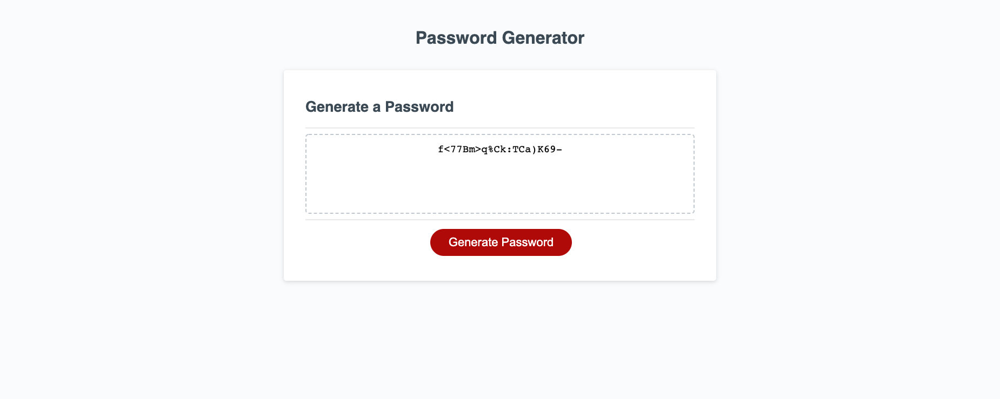

# Homework 3 - Password Generator - Michael Mallon

## What I did
This week's homework assignment provided us with the HTML and CSS code which served as a driver for the JavaScript code we wrote. I used JavaScript elements such as variables, arrays, if statements, loops and functions to achieve the task given.

The JavaScript code that I wrote will ask the user a series of questions via browser window prompts and confirm windows. Validation was added to ensure the user provided the appropriate password length and that he/she selected yes to at least one of the password elements.

### Motivation:
This was the first application that I developed using JavaScript. We have gone through class assignments where small bits of code were written but this one challenged me and I have a far better understanding of how JavaScript works because of it. I am motivated to learn JavaScript because I know it is the bridge between website and server-side Node JS code that I want to learn how to develop.

### Problems I solved:
    * Developed generate password function
    * Referenced math random number library/function (see credits section)
    * Used if statements to build available characters array
    * Used loops to validate user input
    * Used loop to insert random address of available characters array to password array address
    * Used special characters to ensure single and double quotes could be used in the password as well as back slash

## Installation:
Download all associated files in this repository including the index.html file and all files in the assets folder. Style sheet is located in ../assets/css/style.css, JavaScript is located in ../assets/js/script/js

## Usage:
The website has been deployed and can be accessed publicly by clicking [here](https://main.d26zih3hbchcru.amplifyapp.com/)

The website should look like this:

## Credits
- SMU
- Trilogy Education Services
- [Mozilla](https://developer.mozilla.org/en-US/docs/Web/JavaScript/Reference/Global_Objects/Math/random)
- [OWASP](https://www.owasp.org/index.php/Password_special_characters)
